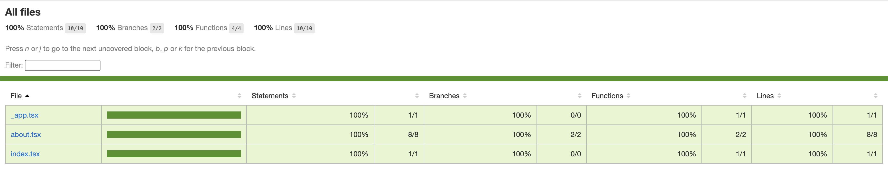

This is a [Next.js](https://nextjs.org/) project bootstrapped with [`create-next-app`](https://github.com/vercel/next.js/tree/canary/packages/create-next-app) for the express purpose of demonstrating Next.js, TypeScript, and Cypress working together with working coverage reports.

## Older Versions

You can see an example that should work with any combination of Next.js 9 thru 12 and Cypress 5 thru 9
[here](https://github.com/kylemh/next-ts-with-cypress-coverage/tree/next9thru12-and-cypress5thru9).

## Contributing

Instructions on how to get started with this repo are below. Contributions we would love to receive:

- An example without Babel. This would use the
  [SWC Coverage Plugin](https://github.com/kwonoj/swc-plugin-coverage-instrument). The current examples all have a
  slower build, slower dev server, and slower hot reload than Next.js applications that DONT use Babel.
- An example using [Next.js's App Directory](https://beta.nextjs.org/docs/getting-started) and providing coverage for
  server components.
- Use GitHub Actions to prove that coverage is outputting so that people can freely contribute without manual review on
  their branch.

## Getting Started

First, run the development server:

```bash
npm run dev
# or
yarn dev
```

Open [http://localhost:3000](http://localhost:3000) with your browser to see the result.

Then open the Cypress test runner:

```bash
npm run cypress open
# or
yarn cypress open
```

## The Proof

To see coverage, `yarn build && yarn start` followed with a separate `yarn cypress run`.
Once finished, `yarn see-cy-coverage`.


